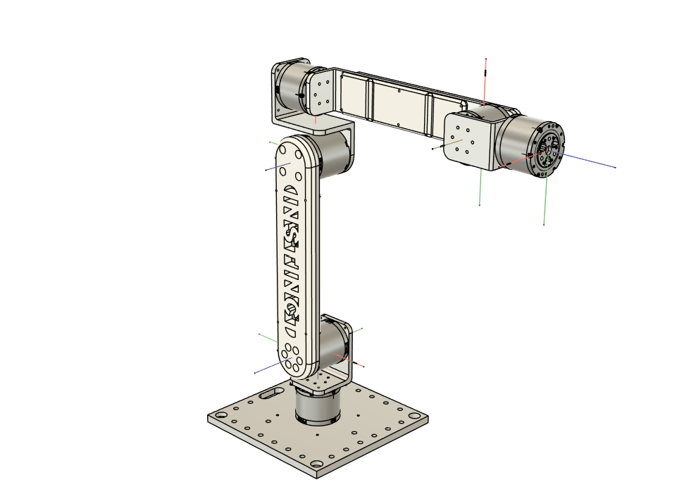
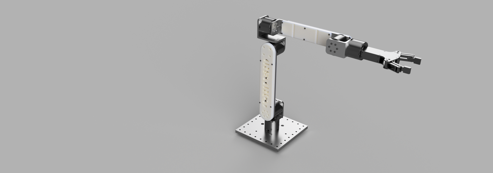

# Instinct2 arm project

提出一种桌面级六轴机械臂

[Instinct2DH参数](DH参数和电机型号.xlsx)

# Build Resources
## 清单
需要达妙电机六台，钣金打印件、PLA打印件、光学平台以及螺丝线束等即可完成组装，组装总时间不超过3小时

## CAD Files and Onshape document
Steps 文件已提供

# Project Updates & Contact
## To Do List
- 基于Pieper准则的封闭解析解逆解实现
- 利用ROS及MoveIt完成轨迹规划及柔顺控制
- 结合Quest设备进行遥操作
- 与灵巧手组合作为模仿学习低成本实现平台

## Contact

如果您有更好的改进方案，欢迎对原版进行任何优化！
欢迎通过rayzhao1390@qq.com与我联系交流！

